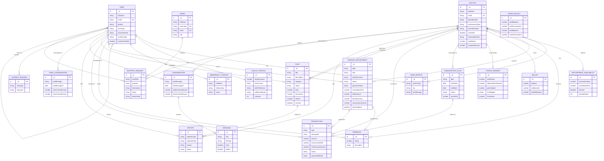

# Logical Entity-Relationship Diagram

```mermaid
erDiagram

    %% ─────────────────────────────────────────
    %%  CORE ACTORS
    %% ─────────────────────────────────────────

    USER {
        id              _id         PK
        string          fullName
        string          email       UK
        string          gender
        string          userType
        string          phoneNumber
        string          sosMessage
        boolean         sosShareProfile
    }

    DOCTOR {
        id              _id         PK
        string          fullName
        string          email       UK
        string          specialization
        string          professionalType
        string          licenseNumber
        boolean         isVerified
        string          subscriptionPlan
        number          avgRating
        number          completedCount
    }

    ADMIN {
        id              _id         PK
        string          fullName
        string          username    UK
        string          email       UK
        string          role
    }

    %% ─────────────────────────────────────────
    %%  PROFILE & HEALTH
    %% ─────────────────────────────────────────

    USER_PROFILE {
        id              _id         PK
        string          ownerType
        string          bio
        string          profileImage
    }

    HEALTH_PROFILE {
        id              _id         PK
        number          sleepDuration
        string          stressLevel
        string          dietPreference
        string          additionalNotes
        list            interests
    }

    EMERGENCY_CONTACT {
        id              _id         PK
        string          fullName
        string          relationship
        string          email
    }

    %% ─────────────────────────────────────────
    %%  APPOINTMENTS
    %% ─────────────────────────────────────────

    APPOINTMENT_AVAILABILITY {
        id              _id         PK
        number          sessionDuration
        number          consultationFee
        boolean         isActive
        list            specificDates
    }

    BOOKED_APPOINTMENT {
        id              _id         PK
        string          date
        string          time
        string          healthConcern
        string          status
        string          paymentStatus
        number          consultationFee
        number          heldAmount
        number          doctorEarning
        number          commissionAmount
        boolean         hasFeedback
    }

    FEEDBACK {
        id              _id         PK
        number          rating
        string          description
    }

    %% ─────────────────────────────────────────
    %%  FINANCIALS
    %% ─────────────────────────────────────────

    SUBSCRIPTION_PLAN {
        id              _id         PK
        string          plan
        date            startDate
        date            endDate
        string          status
        number          pricePKR
    }

    TRANSACTION {
        id              _id         PK
        string          type
        string          description
        number          amount
        number          commissionRate
        number          commissionAmount
        string          status
        string          paymentMethod
    }

    WALLET {
        id              _id         PK
        number          balance
        number          totalEarned
        number          totalWithdrawn
    }

    ADMIN_WALLET {
        id              _id         PK
        number          totalBalance
        number          totalCommission
        number          heldBalance
        number          totalTransactions
    }

    POINTS_REWARD {
        id              _id         PK
        number          totalPoints
        number          lifetimePointsEarned
        number          pointsSpent
        string          trustBadge
        number          trustScore
    }

    %% ─────────────────────────────────────────
    %%  COMMUNITY
    %% ─────────────────────────────────────────

    POST {
        id              _id         PK
        string          title
        string          description
        string          category
        string          status
        number          likes
        number          comments
        number          shares
        boolean         isActive
    }

    REPORT {
        id              _id         PK
        string          reporterType
        string          reportedType
        string          reason
        string          status
    }

    %% ─────────────────────────────────────────
    %%  MESSAGING
    %% ─────────────────────────────────────────

    CONVERSATION {
        id              _id         PK
        string          lastMessage
        date            lastMessageAt
        number          patientUnreadCount
        number          doctorUnreadCount
    }

    MESSAGE {
        id              _id         PK
        string          text
        string          fileType
        boolean         read
        boolean         edited
    }

    USER_CONVERSATION {
        id              _id         PK
        string          lastMessage
        date            lastMessageAt
        number          user1UnreadCount
        number          user2UnreadCount
    }

    CHATBOT_SESSION {
        id              _id         PK
        string          message
        string          response
    }

    SUPPORT_REQUEST {
        id              _id         PK
        string          userRole
        string          purpose
        string          description
        string          status
        string          adminNote
    }

    %% ═══════════════════════════════════════════════════════
    %%  RELATIONSHIPS
    %% ═══════════════════════════════════════════════════════

    %% -- Profile & Health --
    USER            ||--o|   USER_PROFILE        : "has"
    DOCTOR          ||--o|   USER_PROFILE        : "has"
    USER            ||--||   HEALTH_PROFILE      : "has"
    USER            ||--o{   EMERGENCY_CONTACT   : "lists"

    %% -- Block (self-referential) --
    USER            }o--o{   USER                : "blocks"

    %% -- Appointment Flow --
    DOCTOR          ||--o|   APPOINTMENT_AVAILABILITY : "defines"
    USER            ||--o{   BOOKED_APPOINTMENT  : "books"
    DOCTOR          ||--o{   BOOKED_APPOINTMENT  : "receives"
    BOOKED_APPOINTMENT ||--o| FEEDBACK           : "reviewed via"
    USER            ||--o{   FEEDBACK            : "writes"
    DOCTOR          ||--o{   FEEDBACK            : "receives"

    %% -- Financials --
    DOCTOR          ||--o|   WALLET              : "owns"
    DOCTOR          ||--o|   POINTS_REWARD       : "accumulates"
    DOCTOR          ||--o{   SUBSCRIPTION_PLAN   : "subscribes to"
    SUBSCRIPTION_PLAN ||--o| TRANSACTION         : "billed via"
    DOCTOR          ||--o{   TRANSACTION         : "involved in"
    USER            ||--o{   TRANSACTION         : "involved in"
    BOOKED_APPOINTMENT ||--o{ TRANSACTION        : "generates"

    %% -- Community --
    USER            ||--o{   POST                : "publishes"
    DOCTOR          ||--o{   POST                : "publishes"
    DOCTOR          ||--o{   POST                : "approves"
    USER            ||--o{   REPORT              : "files"
    DOCTOR          ||--o{   REPORT              : "files"
    POST            ||--o{   REPORT              : "subject of"

    %% -- Doctor-Patient Messaging --
    USER            ||--o{   CONVERSATION        : "participates in"
    DOCTOR          ||--o{   CONVERSATION        : "participates in"
    CONVERSATION    ||--o{   MESSAGE             : "contains"

    %% -- User-User Messaging --
    USER            ||--o{   USER_CONVERSATION   : "participates in"

    %% -- Chatbot & Support --
    USER            ||--o{   CHATBOT_SESSION     : "chats via"
    USER            ||--o{   SUPPORT_REQUEST     : "submits"
    DOCTOR          ||--o{   SUPPORT_REQUEST     : "submits"
    ADMIN           ||--o{   SUPPORT_REQUEST     : "resolves"
```
